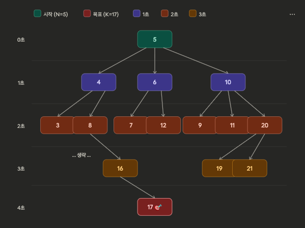

# 📝 문제 풀이 보고서
## 숨바꼭질 (BOJ 1697)

> 🔗 [문제 링크](https://www.acmicpc.net/problem/1697)

---

## ⏱️ 문제 풀이 시간
**총 소요 시간: 약 60분**

---

## 📊 문제 난이도
🟡 **보통**

---

## ⚙️ 사용한 알고리즘
- **BFS (너비 우선 탐색)**: 최단 시간(최소 이동 횟수) 보장
- **시뮬레이션**: 각 위치에서 가능한 3가지 이동 적용

---

## 💡 풀이 과정 (생각의 흐름)

### 1단계: 문제 분석 및 완전탐색 가능 여부 판단

**핵심 결정 사항 파악**
> 수빈이의 위치 N에서 동생의 위치 K까지 **최소 시간**으로 도달하는 경로 탐색

**이동 방식**
```
현재 위치 X에서:
→ X - 1 (걷기)
→ X + 1 (걷기)
→ 2 * X (순간이동)
```

**시간복잡도 검증**
```
위치 범위: 0 ~ 100,000
가능한 상태 수: 100,001개
각 상태에서 이동 방향: 3가지
→ O(100,001 × 3) → 완전탐색으로 충분히 가능
```

---

### 2단계: 알고리즘 설계

**BFS를 선택한 이유**

최단 경로(최소 이동 횟수)를 보장하는 알고리즘 → BFS
```
상태: 수빈이의 현재 위치 (정수)
전이: X → X-1, X+1, 2*X
목표: K에 도달하는 최소 이동 횟수
```

**visited 배열 설계**

- `boolean`이 아닌 `int[]`로 선언
- `visited[x]` = x에 도달하는 데 걸린 시간
- 초기값 `-1`로 설정하여 방문 여부 명확히 구분
```
visited[n] = 0  (시작점)
visited[nx] = visited[cur] + 1  (다음 위치)
```

---

### 3단계: 구현
```java
public static int solution(int n, int k) {
    int[] visited = new int[100001];
    Arrays.fill(visited, -1);

    Queue<Integer> queue = new LinkedList<>();
    queue.add(n);
    visited[n] = 0;

    while (!queue.isEmpty()) {
        int cur = queue.poll();

        if (cur == k) return visited[cur];

        int[] next = {cur - 1, cur + 1, cur * 2};
        for (int nx : next) {
            if (nx < 0 || nx > 100000 || visited[nx] != -1) continue;
            queue.add(nx);
            visited[nx] = visited[cur] + 1;
        }
    }

    return -1;
}
```

---

## 📊 총 시간복잡도
```
O(100,001 × 3) = O(N)
```

---

## 💁🏻 회고

**BFS가 최단 경로를 보장하는 이유**
- BFS는 가까운 노드부터 탐색하므로 K에 처음 도달하는 순간이 항상 최단 경로
- DFS나 재귀는 최단을 보장하지 않음

**visited 초기값 설계의 중요성**
- `int[]` 배열 기본값은 `0`이므로 시간 정보와 혼동될 수 있음
- `Arrays.fill(visited, -1)`로 초기화하여 방문 여부를 명확히 구분
- 방문 체크 조건: `visited[nx] != -1`

**기본형 배열 사용 습관화**
```java
// ❌ 박싱/언박싱 비용 발생
for (int nx : Arrays.asList(-1, 1, 2))

// ✅ 기본형 배열 직접 사용
int[] next = {cur - 1, cur + 1, cur * 2};
```

